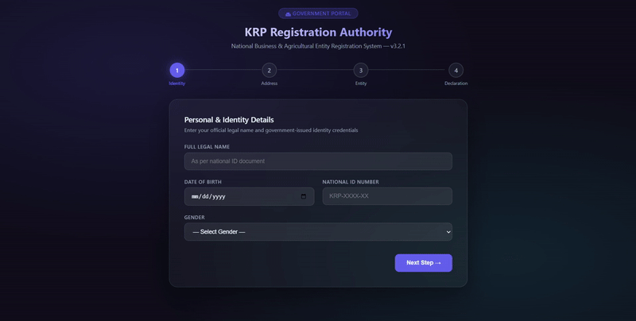

<div align="center">

# 🌐 FormAnchor Web

### The official marketing & legal showcase site for the FormAnchor Chrome Extension

A dark, glassmorphic landing page — built with React, TypeScript, and a rate-limited FastAPI backend — that explains what FormAnchor does, lets people install it, and handles contact/subscribe requests.

[](https://react.dev/)
[](https://www.typescriptlang.org/)
[](https://vitejs.dev/)
[](https://fastapi.tiangolo.com/)
[](https://www.mongodb.com/)
[](LICENSE)

</div>

---
📖 See [USER_GUIDE.md](./USER_GUIDE.md) for extension installation and usage instructions.

## 📚 Table of Contents

- [What This Is](#what-this-is)
- [Preview](#-preview)
- [Tech Stack](#-tech-stack)
- [Design System](#-design-system)
- [Folder Structure](#-folder-structure)
- [Getting Started](#-getting-started)
- [Static Production Deployment](#-static-production-deployment)
- [Related Project](#-related-project)
- [License](#-license)

---

## What This Is

This repo is **not** the FormAnchor Chrome Extension itself — it's the public-facing site that explains it: what it does, how to install it, and the legal/privacy pages that go with it.

- **Frontend** — a static, single-page React app (Home / About / Install / FAQ / Contact / Privacy / Security / License) using `HashRouter`, so it deploys cleanly to GitHub Pages, Netlify, or Vercel with zero server-side routing config.
- **Backend** — a small FastAPI service that exists for exactly one job: handling the Contact and Subscribe forms, with honeypot spam protection and rate limiting, storing submissions in MongoDB.

> Looking for the actual extension source code (the automation engines, selector logic, etc.)? That lives in the [FormAnchor extension repo](https://github.com/Sachin-Rawal091/FORMANCHOR).

---

## 🎬 Preview

<div align="center">



</div>

---

## 🛠 Tech Stack

**Frontend**
- React 18 + TypeScript + Vite
- `HashRouter` for static-host-friendly routing (works out of the box on GitHub Pages)
- Dark glassmorphic UI — border-only cards, no heavy shadows
- Pages: Home, About, Install, FAQ, Contact, Privacy, Security, License

**Backend**
- FastAPI + MongoDB (via **Motor**, the async driver)
- Pydantic for request/response schema validation
- `slowapi` for rate limiting on public endpoints
- Resend for transactional email
- Honeypot field spam protection on form submissions
- Endpoints: `/api/contact`, `/api/subscribe`

---

## 🎨 Design System

| Token | Value |
|---|---|
| Primary (blue) | `#5b8cff` |
| Accent (violet) | `#7c3aed` |
| Background (dark) | `#0f1115` |
| Headings | Public Sans / Outfit |
| Body | Inter |
| Card style | Glassmorphic, border-only |

---

## 📁 Folder Structure

```text
Formpilot_Template/
├── docker-compose.yml       # Orchestrates FastAPI + MongoDB container services
├── README.md
│
├── frontend/                # React + TS + Vite (Static Landing Page)
│   ├── public/               # demo.gif, demo.mp4, icons, sitemap.xml, robots.txt
│   └── src/
│       ├── pages/            # Home, About, Install, Faq, Contact, Privacy, Security, License
│       ├── components/
│       └── hooks/
│
└── backend/                  # FastAPI REST API (stores contact/subscribe form submissions)
    ├── Dockerfile
    ├── main.py               # API routes & rate-limiting middleware
    ├── database.py           # MongoDB Async Motor client
    └── models.py              # Pydantic schema validations
```

---

## 🚀 Getting Started

You can run this locally with **Docker Compose** (recommended — spins up Mongo for you) or by running the frontend and backend individually.

### Method 1 — Docker Compose (recommended)

```bash
# from the Formpilot_Template/ root
docker-compose up --build
```

This starts the FastAPI backend at `http://localhost:8000` and a MongoDB container. In a separate terminal:

```bash
cd frontend
npm run dev
```

Open the local Vite server (typically `http://localhost:5173`). Go to **Contact** and submit a message — it writes straight to your local MongoDB container.

### Method 2 — Running individually (no Docker)

<details>
<summary>Expand for manual setup steps</summary>

**1. Start MongoDB** locally at `mongodb://localhost:27017`.

**2. Start the backend**
```bash
cd backend
python -m venv venv
# Windows:
.\venv\Scripts\activate
# macOS/Linux:
source venv/bin/activate

pip install -r requirements.txt
uvicorn main:app --reload --port 8000
```

**3. Start the frontend**
```bash
cd frontend
npm install
npm run dev
```

</details>

---

## 📦 Static Production Deployment

The frontend can be deployed on its own — the backend is only needed if you want live Contact/Subscribe form storage.

```bash
cd frontend
npm run build
```

This produces an optimized static bundle in `frontend/dist/`. Upload it to any static host — GitHub Pages, Netlify, or Vercel all work with **zero routing config**, since the app uses `HashRouter` (`#/about`, `#/install`, etc.), so direct links and page refreshes work out of the box.

---

## 🔗 Related Project

This site showcases **[FormAnchor](./FormAnchor.md)** — a Chrome extension that records a form-filling flow once and replays it across spreadsheet rows, with self-healing selectors for real-world, multi-page forms. If you're here for the product itself rather than the marketing site, that's where the code lives.
